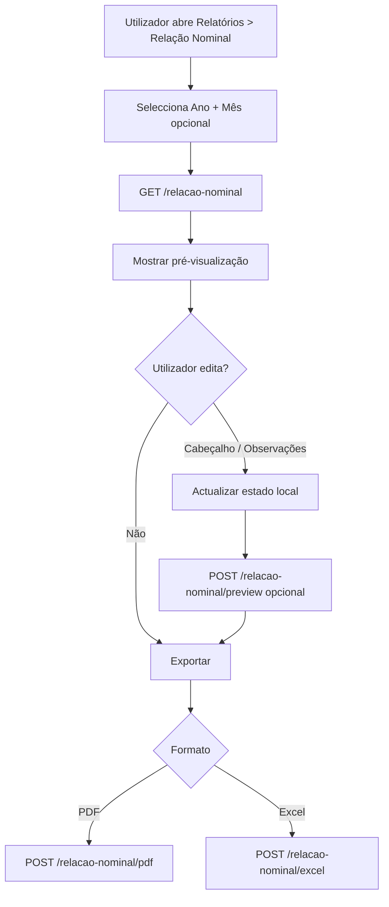

# Relação Nominal — Guia de integração Frontend

Documento de alinhamento entre **PeopleCore API** e **módulo de Relatórios (frontend)** para implementar a exportação da **Relação Nominal** oficial (MITESS — Moçambique).

---

## 1. Objetivo

Permitir ao utilizador:

1. Seleccionar **ano** (e opcionalmente **mês** e **estabelecimento**)
2. **Pré-visualizar** o relatório (cabeçalho + tabela de trabalhadores)
3. **Editar** campos do cabeçalho e **observações** por trabalhador antes de imprimir
4. **Exportar** em **PDF** ou **Excel** com layout oficial (brasão, 3 colunas, 25 colunas na tabela)

> **MVP:** filtro principal por **ano**. O mês pode ficar oculto com valor por defeito (mês actual) ou visível como filtro secundário.

---

## 2. Base URL e autenticação

| Item | Valor |
|------|--------|
| Base | `{API_URL}/api/v1/reports` |
| Auth | `Authorization: Bearer <JWT>` (obrigatório em todas as rotas) |
| Empresa | Vem de `req.user.empresa_id` automaticamente |
| Super-admin | Enviar `empresa_id` na query (GET) ou body (POST) |

---

## 3. Endpoints

| Acção | Método | Endpoint | Uso |
|--------|--------|----------|-----|
| Carregar preview inicial | `GET` | `/relacao-nominal` | Primeira carga ao seleccionar filtros |
| Actualizar preview com edições | `POST` | `/relacao-nominal/preview` | Após editar cabeçalho/observações |
| Exportar PDF (sem edições) | `GET` | `/relacao-nominal/pdf` | Exportação directa |
| Exportar PDF (com edições) | `POST` | `/relacao-nominal/pdf` | **Recomendado** após pré-visualização |
| Exportar Excel (sem edições) | `GET` | `/relacao-nominal/excel` | Exportação directa |
| Exportar Excel (com edições) | `POST` | `/relacao-nominal/excel` | **Recomendado** após pré-visualização |

---

## 4. Parâmetros

### Query (GET) ou Body (POST)

| Campo | Tipo | Obrigatório | Descrição |
|--------|------|-------------|-----------|
| `ano` | `number` | **Sim** | Ex.: `2026` |
| `mes` | `number` (1–12) ou `string` | Não | Ex.: `10` ou `"Outubro"`. Se omitido → mês actual |
| `sub_unidade_id` | `string` | Não | Filtrar por estabelecimento/unidade |
| `empresa_id` | `string` | Só super-admin | ID da empresa |
| `personalizacao` | `object` | Não | Edições da pré-visualização (ver §6) |

### Exemplos

```http
GET /api/v1/reports/relacao-nominal?ano=2026&mes=10
Authorization: Bearer <token>
```

```http
POST /api/v1/reports/relacao-nominal/pdf
Authorization: Bearer <token>
Content-Type: application/json

{
  "ano": 2026,
  "mes": 10,
  "personalizacao": { ... }
}
```

---

## 5. Resposta JSON (preview)

```json
{
  "status": "success",
  "data": {
    "cabecalho": {
      "numero_folha": "2026-BF366",
      "data_emissao": "27/07/2026",
      "orgao_sindical": "",
      "declarante": "",
      "mes": "Outubro",
      "ano": 2026,
      "mes_numero": 10,
      "empresa": {
        "nome": "Kenmare Resources (Moma Mining)",
        "endereco": "...",
        "localidade": "Maputo",
        "provincia": "Maputo",
        "distrito": "",
        "caixa_postal": "",
        "codigo_postal": "",
        "fax": "",
        "telefone": "...",
        "email": "...",
        "nuit": "...",
        "forma_juridica": "",
        "orgao_tutela": "",
        "ano_constituicao": 2010,
        "actividade_principal": "",
        "inss": "",
        "num_trabalhadores": 25,
        "capital_social": "",
        "capital_privado_nacional_pct": "",
        "capital_publico_pct": "",
        "capital_estrangeiro_pct": "",
        "volume_vendas": "",
        "fundo_salarios": ""
      },
      "estabelecimento": {
        "nome": "...",
        "endereco": "...",
        "localidade": "...",
        "provincia": "...",
        "distrito": "",
        "codigo_postal": "",
        "fax": "",
        "telefone": "...",
        "email": "...",
        "nuit": "...",
        "inss": "",
        "actividade_principal": "",
        "num_trabalhadores": 25,
        "num_originais": 1,
        "num_nacional": 23,
        "num_estrangeiro": 2,
        "num_total": 25
      }
    },
    "linhas": [
      {
        "linha": 1,
        "funcionario_id": "69ae6e9398fa38e8073bf372",
        "inss": "...",
        "nome": "João Manuel Tembe",
        "nuit_passaporte": "...",
        "naturalidade_nacionalidade": "Moçambique",
        "profissao": "Técnico",
        "categoria_profissional": "Nível III",
        "situacao_profissao": "Ativo",
        "habilitacoes": "Licenciatura",
        "tipo_contrato": "Efetivo",
        "regime_trabalho": "Integral",
        "sexo": "1",
        "data_nascimento": "05/1990",
        "data_admissao": "03/2020",
        "data_ultima_promocao": "",
        "rem_base": 45000,
        "rem_premios_regulares": 5000,
        "rem_horas_extras": 1200,
        "rem_premios_irregulares": 0,
        "horas_normais": 173.3,
        "horas_extraordinarias": 8,
        "periodo_semanal": 40,
        "dias_nao_remunerados": 0,
        "observacoes": ""
      }
    ],
    "folhaId": "674a1b2c3d4e5f6789012345",
    "campos_editaveis": {
      "cabecalho_manual": [
        "numero_folha",
        "data_emissao",
        "orgao_sindical",
        "declarante",
        "empresa.nome",
        "empresa.endereco",
        "..."
      ],
      "observacoes_por_linha": true
    }
  }
}
```

### Campos importantes

| Campo | Significado |
|--------|-------------|
| `folhaId` | `null` → folha do mês **não processada**; mostrar aviso na UI |
| `funcionario_id` | Chave para enviar observações na personalização |
| `sexo` | `"1"` = Masculino, `"2"` = Feminino |
| `campos_editaveis` | Lista de campos que o frontend deve permitir editar na preview |

---

## 6. Personalização (edições antes da exportação)

Objecto `personalizacao` enviado no **body** dos endpoints `POST`.

```typescript
interface PersonalizacaoRelacaoNominal {
  cabecalho_manual?: {
    numero_folha?: string;
    data_emissao?: string;       // DD/MM/AAAA
    orgao_sindical?: string;
    declarante?: string;
    empresa?: Partial<CabecalhoEmpresa>;
    estabelecimento?: Partial<CabecalhoEstabelecimento>;
  };
  observacoes?: Array<{
    funcionario_id?: string;     // preferir este
    linha?: number;              // alternativa
    observacoes?: string;
  }>;
}
```

### Exemplo completo

```json
{
  "ano": 2026,
  "mes": 10,
  "personalizacao": {
    "cabecalho_manual": {
      "numero_folha": "2026-12679",
      "data_emissao": "21/04/2026",
      "orgao_sindical": "Sindicato dos Trabalhadores",
      "declarante": "Responsável RH",
      "empresa": {
        "forma_juridica": "Sociedade Anónima",
        "inss": "123456789"
      }
    },
    "observacoes": [
      {
        "funcionario_id": "69ae6e9398fa38e8073bf372",
        "observacoes": "Trabalhador em licença parcial"
      }
    ]
  }
}
```

---

## 7. Exportação de ficheiros (PDF / Excel)

### Resposta

- **Content-Type PDF:** `application/pdf`
- **Content-Type Excel:** `application/vnd.openxmlformats-officedocument.spreadsheetml.sheet`
- **Content-Disposition:** `attachment; filename="relacao-nominal-{numero_folha}-{mes}-{ano}.pdf"`

### Implementação frontend

```typescript
async function downloadRelacaoNominal(
  formato: 'pdf' | 'excel',
  payload: RelacaoNominalRequest,
) {
  const endpoint =
    formato === 'pdf'
      ? '/reports/relacao-nominal/pdf'
      : '/reports/relacao-nominal/excel';

  const response = await api.post(endpoint, payload, {
    responseType: 'blob',
  });

  const disposition = response.headers['content-disposition'] ?? '';
  const match = disposition.match(/filename="(.+)"/);
  const filename =
    match?.[1] ?? `relacao-nominal-${payload.ano}.${formato === 'pdf' ? 'pdf' : 'xlsx'}`;

  const url = window.URL.createObjectURL(response.data);
  const a = document.createElement('a');
  a.href = url;
  a.download = filename;
  a.click();
  window.URL.revokeObjectURL(url);
}
```

> **Importante:** usar sempre `POST` para exportar após o utilizador editar a pré-visualização, enviando o mesmo `personalizacao` construído na UI.

---

## 8. Fluxo UX recomendado



### Passos

1. **Filtros** — Ano (obrigatório), Mês (opcional), Estabelecimento (opcional)
2. **Carregar** — `GET /relacao-nominal?ano=2026&mes=10`
3. **Pré-visualizar** — Renderizar layout oficial (ver §9)
4. **Editar** — Inputs nos campos do cabeçalho + textarea na coluna Observações
5. **Exportar** — `POST` com `personalizacao` preenchida

---

## 9. Layout da pré-visualização (espelhar o PDF oficial)

### Cabeçalho — 3 colunas

```
┌─────────────────────────┬──────────────────┬─────────────────────────┐
│ Dados relativos à       │   [BRASÃO MZ]    │ Dados relativos ao        │
│ Empresa (1–11)          │ REPÚBLICA DE     │ estabelecimento (12–17)  │
│                         │ MOÇAMBIQUE       │                         │
│ Campos com linha para   │ MITESS           │ Campos com linha para   │
│ preenchimento manual    │ RELAÇÃO NOMINAL  │ preenchimento manual      │
│                         │ Nº Folha: ____   │                         │
├─────────────────────────┴──────────────────┴─────────────────────────┤
│ Data emissão: ______  |  O Órgão Sindical: ______  |  O Declarante: ___ │
│ Referente a: {mes} de {ano}                                            │
└────────────────────────────────────────────────────────────────────────┘
```

### Regras visuais

- Campos do cabeçalho: **rótulo + linha/underline** (não inputs compactos)
- Valores do sistema pré-preenchidos mas **editáveis**
- Campos vazios mostram linha em branco (preenchimento manual ou na UI)
- **Órgão Sindical** e **Declarante**: área larga para assinatura/texto

### Tabela — 25 colunas

| Grupo | Colunas |
|--------|---------|
| Identificação | 1–13 (até Sexo) |
| **DATAS (só mês/ano)** | 14 Nascimento, 15 Admissão, 16 Última promoção |
| **REMUNERAÇÕES PAGAS NO MÊS** | 17 Base, 18 Prémios regulares, 19 Horas extra, 20 Prémios irregulares |
| **HORAS MENSAIS** | 21 Normais, 22 Extraordinárias |
| Outros | 23 Período semanal, 24 Dias não remunerados, **25 Observações** |

> Coluna **25 (Observações)** deve ser **editável** na pré-visualização (`<input>` ou `<textarea>` por linha).

---

## 10. Estrutura de componentes sugerida

```
src/
  features/
    relatorios/
      relacao-nominal/
        RelacaoNominalPage.tsx          # Página principal
        RelacaoNominalFiltros.tsx       # Ano, mês, estabelecimento
        RelacaoNominalPreview.tsx       # Container da preview
        RelacaoNominalCabecalho.tsx     # 3 colunas editáveis
        RelacaoNominalTabela.tsx        # 25 colunas + obs editável
        relacaoNominalService.ts        # Chamadas API
        relacaoNominalTypes.ts          # Tipos TS
        useRelacaoNominal.ts            # Hook de estado
```

### Estado local (hook)

```typescript
interface RelacaoNominalState {
  filtros: { ano: number; mes?: number; sub_unidade_id?: string };
  cabecalho: Cabecalho | null;
  linhas: LinhaTrabalhador[];
  personalizacao: PersonalizacaoRelacaoNominal;
  loading: boolean;
  exporting: 'pdf' | 'excel' | null;
  folhaId: string | null;
}
```

### Construir `personalizacao` a partir da UI

```typescript
function buildPersonalizacao(
  cabecalhoEditado: Cabecalho,
  linhasEditadas: LinhaTrabalhador[],
): PersonalizacaoRelacaoNominal {
  return {
    cabecalho_manual: {
      numero_folha: cabecalhoEditado.numero_folha,
      data_emissao: cabecalhoEditado.data_emissao,
      orgao_sindical: cabecalhoEditado.orgao_sindical,
      declarante: cabecalhoEditado.declarante,
      empresa: cabecalhoEditado.empresa,
      estabelecimento: cabecalhoEditado.estabelecimento,
    },
    observacoes: linhasEditadas
      .filter((l) => l.observacoes?.trim())
      .map((l) => ({
        funcionario_id: l.funcionario_id,
        observacoes: l.observacoes,
      })),
  };
}
```

---

## 11. Tipos TypeScript

```typescript
export interface CabecalhoEmpresa {
  nome: string;
  endereco: string;
  localidade: string;
  provincia: string;
  distrito: string;
  caixa_postal: string;
  codigo_postal: string;
  fax: string;
  telefone: string;
  email: string;
  nuit: string;
  forma_juridica: string;
  orgao_tutela: string;
  ano_constituicao: number | string;
  actividade_principal: string;
  inss: string;
  num_trabalhadores: number;
  capital_social: number | string;
  capital_privado_nacional_pct: number | string;
  capital_publico_pct: number | string;
  capital_estrangeiro_pct: number | string;
  volume_vendas: number | string;
  fundo_salarios: number | string;
}

export interface CabecalhoEstabelecimento {
  nome: string;
  endereco: string;
  localidade: string;
  provincia: string;
  distrito: string;
  codigo_postal: string;
  fax: string;
  telefone: string;
  email: string;
  nuit: string;
  inss: string;
  actividade_principal: string;
  num_trabalhadores: number;
  num_originais: number;
  num_nacional: number;
  num_estrangeiro: number;
  num_total: number;
}

export interface Cabecalho {
  numero_folha: string;
  data_emissao: string;
  orgao_sindical: string;
  declarante: string;
  mes: string;
  ano: number;
  mes_numero: number;
  empresa: CabecalhoEmpresa;
  estabelecimento: CabecalhoEstabelecimento;
}

export interface LinhaTrabalhador {
  linha: number;
  funcionario_id: string;
  inss: string;
  nome: string;
  nuit_passaporte: string;
  naturalidade_nacionalidade: string;
  profissao: string;
  categoria_profissional: string;
  situacao_profissao: string;
  habilitacoes: string;
  tipo_contrato: string;
  regime_trabalho: string;
  sexo: '1' | '2' | '';
  data_nascimento: string;
  data_admissao: string;
  data_ultima_promocao: string;
  rem_base: number;
  rem_premios_regulares: number;
  rem_horas_extras: number;
  rem_premios_irregulares: number;
  horas_normais: number;
  horas_extraordinarias: number;
  periodo_semanal: number;
  dias_nao_remunerados: number;
  observacoes: string;
}

export interface RelacaoNominalRequest {
  ano: number;
  mes?: number | string;
  sub_unidade_id?: string;
  empresa_id?: string;
  personalizacao?: PersonalizacaoRelacaoNominal;
}
```

---

## 12. Mensagens e avisos na UI

| Situação | Mensagem sugerida |
|----------|-------------------|
| `folhaId === null` | "A folha de {mes}/{ano} ainda não foi processada. O relatório será gerado com dados cadastrais; remunerações podem estar incompletas." |
| `linhas.length === 0` | "Não existem trabalhadores activos para o período seleccionado." |
| Campos vazios no cabeçalho | "Complete os dados da empresa em Configurações para um relatório mais completo." |
| Erro 400 | "Período inválido. Verifique o ano e o mês." |
| Erro 403 | "Sem permissão ou empresa não associada." |

---

## 13. Dados a completar no sistema (fora do relatório)

Para o cabeçalho sair completo, estes campos devem existir no cadastro:

### Empresa (`/api/v1/empresas`)

`forma_juridica`, `orgao_tutela`, `actividade_principal`, `inss_empresa`, `capital_social`, `volume_vendas`, `fundo_salarios`, `localidade`, `distrito`, `numero_folha_nominal`, etc.

### Funcionário (`/api/v1/funcionarios`)

`inss`, `nuit`, `naturalidade`, `passaporte`, `profissao`, `categoria_profissional`, `situacao_profissao`, `data_ultima_promocao`, `periodo_trabalho_semanal`, `observacoes_relacao_nominal`

### Folha de pagamento

Processar a folha do mês/ano antes da exportação para remunerações correctas (`POST /api/v1/folhas-pagamento/:id/processar`).

---

## 14. Critérios de aceitação

- [ ] Utilizador selecciona **ano** e vê pré-visualização
- [ ] Cabeçalho em **3 colunas** com campos editáveis e linhas para preenchimento
- [ ] Coluna **Observações** editável por trabalhador na preview
- [ ] **Exportar PDF** via `POST` inclui edições do cabeçalho e observações
- [ ] **Exportar Excel** via `POST` inclui edições do cabeçalho e observações
- [ ] Download automático com nome de ficheiro correcto
- [ ] Aviso quando `folhaId` é `null`
- [ ] Loading nos botões durante carregamento e exportação
- [ ] Super-admin consegue seleccionar `empresa_id`

---

## 15. Notas técnicas

- **Mês por defeito:** se `mes` não for enviado, o backend usa o **mês actual**
- **Um ficheiro por mês:** não existe endpoint que exporte o ano inteiro num único ficheiro (evolução futura)
- **Brasão no PDF/Excel:** `public/img/users/logo_republica.png` (emblema oficial da República de Moçambique)
- **Relatórios internos (não MITESS):** usam logotipo da subempresa → empresa → sistema (`GET /api/v1/reports/branding?subempresa_id=`). A Relação Nominal **não** usa este branding.
- **Sexo no PDF:** `1` = Masculino, `2` = Feminino (padrão MITESS)
- **Datas na tabela:** formato `MM/AAAA` (só mês e ano)

---

## 16. Checklist rápido para o developer frontend

1. Criar rota `/relatorios/relacao-nominal` no router do frontend
2. Implementar `relacaoNominalService.ts` com os 5 endpoints
3. Filtro **Ano** (obrigatório) + Mês (opcional)
4. Tela de preview com cabeçalho editável + tabela
5. Botões **Exportar PDF** e **Exportar Excel** (`POST` com `personalizacao`)
6. Tratar `blob` no download
7. Testar com folha processada e sem folha processada
8. Testar observações editadas antes da exportação

---

*Última actualização: backend PeopleCore — módulo `/api/v1/reports/relacao-nominal`*
